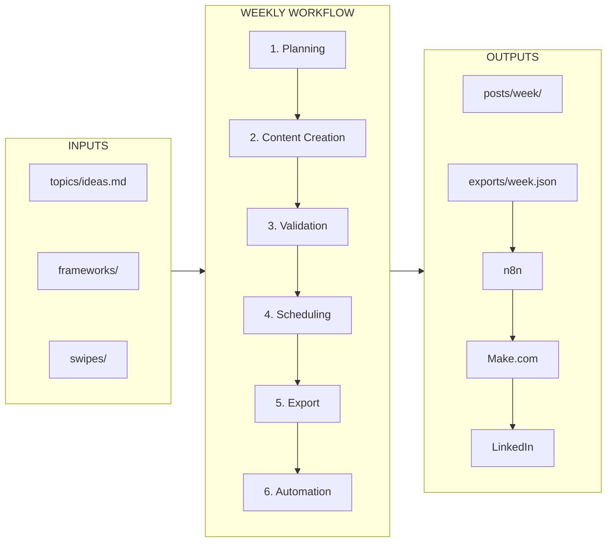

# LinkedIn Content Workflow

A complete LinkedIn content creation system powered by [Claude Code](https://claude.ai/code). Includes proven writing frameworks, compliance-safe scheduling, and optional automation via n8n + Make.com.

## What's Inside

- **Writing frameworks** (SLAY, PAS) with 57 hook templates and 102 viral post structures
- **Compliance engine** — scheduling rules that keep your account safe (no weekend posts, randomized times, format rotation)
- **Content intelligence methodology** — pull from real data sources to write about what your audience actually cares about
- **Automation workflows** — n8n + Make.com blueprints for hands-off posting

## Quick Start

1. Clone this repo and open with Claude Code:
   ```bash
   git clone <this-repo-url>
   cd linkedin-content-template
   claude
   ```

2. Follow the setup guide:
   ```
   Open SETUP.md and help me personalize this system for my profile.
   ```

3. Create your first week of posts:
   ```
   Create 4 LinkedIn posts for this week. Pick topics from ideas.md,
   use the frameworks, validate against the checklist, and schedule them.
   ```

See **[SETUP.md](SETUP.md)** for the full onboarding walkthrough.

## Workflow Overview



## Directory Structure

```
├── CLAUDE.md               # Your personalized voice + strategy (edit this first)
├── SETUP.md                # Step-by-step onboarding guide
├── frameworks/             # Writing frameworks & templates
│   ├── SLAY.md             # Story-Lesson-Actionable-You
│   ├── PAS.md              # Problem-Agitate-Solution
│   ├── winning-hooks.md    # 57 hook templates
│   ├── post-checklist.md   # Validation checklist
│   ├── viral-templates-index.md  # 102 post templates
│   └── ai-prompts.md       # AI brainstorming prompts
├── swipes/                 # Reference posts by pillar
│   ├── educational/
│   ├── storytelling/
│   └── authority-jacking/
├── topics/
│   └── ideas.md            # Your topic backlog
├── posts/{week}/           # Weekly post files (YAML frontmatter + markdown)
├── exports/                # JSON exports for automation
├── workflows/
│   ├── n8n/                # n8n workflow exports
│   └── make/               # Make.com scenario exports
└── tool/
    ├── schedule.py         # Generate compliant posting times
    └── export.py           # Export posts to JSON for automation
```

## Compliance Rules (Built In)

These rules are enforced by `tool/schedule.py` and documented in `CLAUDE.md`:

- **4 posts/week max** (Tue-Thu preferred, Mon/Fri as backup)
- **No weekends**, business hours only (7am-6pm ET)
- **Random minutes** (never :00 or :30)
- **100-300 words**, 0-3 hashtags per post
- **Rotate pillars and formats** — no consecutive repeats
- **No more than 3 consecutive posting days**

## Content Mix Targets

| Pillar | Target |
|--------|--------|
| Educational (how-tos, workflows) | 40% |
| Storytelling (personal/client wins) | 20% |
| Authority Jacking (news + your angle) | 20% |
| Business Transformation | 10% |
| Thought Leadership Questions | 10% |

## Using with Claude Code

This system is designed for Claude Code. The `CLAUDE.md` file gives Claude full context about your voice, expertise, audience, and content rules on every interaction.

### Useful Prompts

| Task | Prompt |
|------|--------|
| Brainstorm topics | "Brainstorm 10 LinkedIn topic ideas based on my expertise" |
| Write a post | "Write a LinkedIn post about [topic] using the SLAY framework" |
| Pick a hook | "Find a hook from winning-hooks.md that fits [topic]" |
| Validate a post | "Check this post against the post checklist and compliance rules" |
| Schedule a week | "Generate schedule times for 4 posts this week" |
| Full week creation | "Create all 4 posts for this week, validate, schedule, and export" |
| Check completeness | "Scan CLAUDE.md for remaining placeholders I need to fill in" |

## License

MIT
